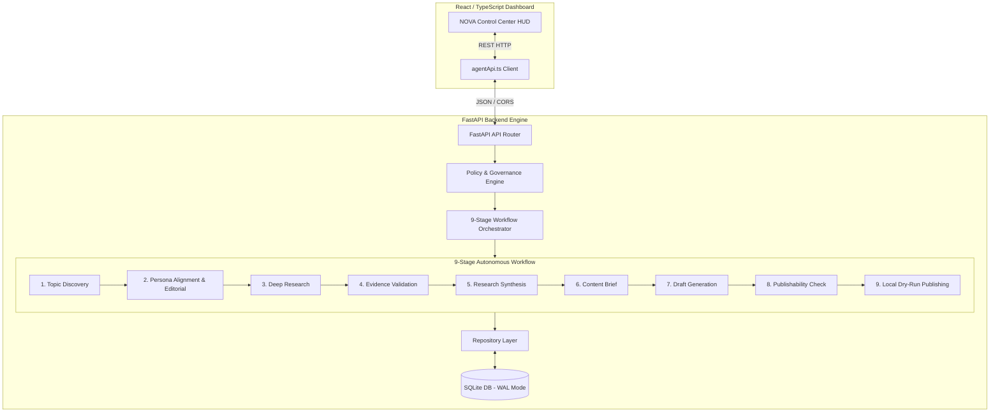

# SignalForge

> **Autonomous AI Technology Intelligence Platform**

[](https://github.com/SARTHAK-AIML-0182/SignalForge)
[](https://github.com/SARTHAK-AIML-0182/SignalForge)
[](https://github.com/SARTHAK-AIML-0182/SignalForge)
[](https://signalforge-wxl5.onrender.com)
[](https://signalforge-1.onrender.com)

SignalForge is an autonomous AI technology intelligence platform powered by **NOVA**, an autonomous technology signal analyst. It ingests raw technology signals, filters out noise against persona-aligned rules, performs deep factual research, validates evidence credibility, synthesizes structured briefs, and publishes evidence-grounded intelligence briefings through a deterministic 9-stage pipeline.

---

## Live Live Deployments

- **Frontend Application**: [https://signalforge-1.onrender.com](https://signalforge-1.onrender.com)
- **Backend REST API**: [https://signalforge-wxl5.onrender.com](https://signalforge-wxl5.onrender.com)
- **Interactive OpenAPI Docs**: [https://signalforge-wxl5.onrender.com/api/docs](https://signalforge-wxl5.onrender.com/api/docs)

---

## Problem & Solution

### The Problem
Technology leaders, engineers, and researchers face severe information overload:
- **High Noise-to-Signal Ratio**: RSS feeds, preprints, and news outlets deliver thousands of unvetted posts daily.
- **Unverified Claims & Hallucinations**: Generic AI summaries often hallucinate or quote unverified sources without grounding.
- **Manual Curation Overhead**: Evaluating relevance, scoring editorial importance, and cross-referencing evidence requires hours of manual effort.

### The Solution
SignalForge automates the end-to-end technology intelligence lifecycle. The platform continuously discovers signals, evaluates editorial fit against an explicit domain persona, executes multi-step evidence validation, synthesizes factual briefs, and delivers concise, evidence-backed briefings—with full traceability and failure isolation at every stage.

---

## Why SignalForge?

Unlike simple news aggregators or generic RSS dashboards, SignalForge operates as an autonomous intelligence agent with explicit governance and policy gates:

1. **Deterministic 9-Stage Pipeline**: Every signal progresses through 9 explicit, observable processing stages.
2. **Persona-Aligned Editorial Filtering**: Topics are scored dynamically against custom domain preferences, excluded categories, and relevance thresholds.
3. **Evidence-Grounded Research**: Raw facts are validated against source credibility metrics before brief generation.
4. **Policy & Governance Safeguards**: Built-in governance rules evaluate execution safety, rate limits, and publishability before any briefing is generated.
5. **Per-Topic Failure Isolation**: If an individual topic fails during validation or synthesis, the error is isolated with sanitized diagnostics while other topics complete successfully.
6. **Full Traceability**: Every published post links back to its underlying research IDs, content brief, validation scores, and source URLs.

---

## Core Features

- **NOVA Agent Persona HUD**: Real-time visualization of agent status, active domain, current objective, and processing stats.
- **Real 9-Stage Autonomous Workflow Execution**: Triggers real backend pipeline runs via `POST /api/agent/{agent_id}/workflow/run`.
- **Live Feed & Briefing Stream**: Ingests and renders published technology briefings with expandability to view underlying sources and editorial scores.
- **Dynamic Persona & Feed Rule Editor**: Interactive modal to update persona domain, description, category filters, and minimum relevance thresholds on the fly.
- **Rejected Topics & Diagnostic Observability**: Inspects rejected topics with sanitized failure reasons (e.g., out of domain, governance block, validation failure).
- **Workflow History & Stage Statistics**: Displays historical workflow execution summaries, duration, status breakdowns, and stage success rates.
- **Rate-Limit & Error Boundary Handling**: Displays countdown banners for HTTP 429 rate limiting (`Retry-After`) and user-friendly notifications for HTTP 422 policy rejections.

---

## System Architecture



---

## 9-Stage Agent Workflow

The backend workflow orchestrator ([`orchestrator.py`](file:///f:/SignalForge/backend/app/services/workflow/orchestrator.py)) executes 9 deterministic stages:

| Stage # | Backend Stage Identifier | Responsible Service | Description |
| :--- | :--- | :--- | :--- |
| **1** | `topic_discovery` | Discovery Engine | Parses raw technology RSS/ArXiv feeds and extracts candidate topics. |
| **2** | `editorial_evaluation` | Editorial Engine | Scores topics against agent persona domain rules and relevance threshold. |
| **3** | `deep_research` | Research Engine | Extracts core facts, claims, and background context for selected topics. |
| **4** | `evidence_validation` | Validation Service | Evaluates factual evidence quality, source credibility, and claim confidence. |
| **5** | `synthesis` | Synthesis Engine | Aggregates validated evidence items into structured research summaries. |
| **6** | `content_brief` | Brief Generator | Constructs structured editorial briefs with key findings and target tone. |
| **7** | `article_writing` | Content Writer | Generates evidence-grounded articles strictly mapped to content briefs. |
| **8** | `governance_gate` | Governance Service | Checks publishability status, safety limits, and governance compliance. |
| **9** | `dry_run_publishing` | Publishing Adapter | Executes local dry-run publication via `DryRunPublishingAdapter`. |

---

## Technology Stack

### Frontend
- **Framework**: React 18 + Vite 8
- **Language**: TypeScript (Strict Mode)
- **Styling**: Tailwind CSS (Dark Technology HUD Aesthetic)
- **Icons**: Lucide React
- **HTTP Client**: Native Fetch API wrapped in `agentApi.ts`
- **Deployment**: Render / Vercel SPA (`_redirects` & `vercel.json` fallbacks)

### Backend
- **Framework**: FastAPI (Async Lifespan)
- **Language**: Python 3.11
- **Database**: SQLite 3 with Write-Ahead Logging (`WAL` mode)
- **Validation**: Pydantic v2 & `pydantic-settings`
- **Testing**: Pytest & `httpx`
- **Server**: Uvicorn (ASGI)
- **Deployment**: Render / Railway

---

## REST API Reference

The FastAPI backend exposes 10 REST endpoints registered under `/api`:

| # | HTTP Method | Endpoint Path | Description |
| :-: | :--- | :--- | :--- |
| **1** | `POST` | `/api/agent/init` | Initialize or load an agent session with default persona. |
| **2** | `GET` | `/api/agent/{agent_id}/persona` | Retrieve current persona configuration. |
| **3** | `PUT` | `/api/agent/{agent_id}/persona` | Update persona name, domain, description, and rules. |
| **4** | `GET` | `/api/agent/{agent_id}/feed/config` | Retrieve feed rules and relevance thresholds. |
| **5** | `PUT` | `/api/agent/{agent_id}/feed/config` | Update category filters and minimum relevance thresholds. |
| **6** | `POST` | `/api/agent/{agent_id}/workflow/run` | Execute the real 9-stage autonomous workflow pipeline. |
| **7** | `GET` | `/api/agent/{agent_id}/workflow/{workflow_id}` | Retrieve execution status of a specific workflow. |
| **8** | `GET` | `/api/agent/{agent_id}/workflow/{workflow_id}/inspection` | Retrieve stage statistics, governance decision, and diagnostics. |
| **9** | `GET` | `/api/agent/{agent_id}/workflows` | List historical workflow summaries with pagination. |
| **10** | `GET` | `/api/agent/feed` | Stream published intelligence briefings for an agent. |

---

## Governance, Safety & Reliability

- **Input Sanitization & Validation**: Pydantic models validate all incoming requests, enforcing type bounds and string constraints.
- **Process-Local Rate Limiting**: Protects backend endpoints against rapid requests, returning HTTP `429 Too Many Requests` with a `Retry-After` header.
- **Governance Policy Gates**: Before workflow execution, policy rules verify maximum topic bounds (`max_topics <= 10`) and editorial threshold limits.
- **Sanitized Exception Handling**: A global exception handler in `main.py` catches unhandled errors and returns sanitized HTTP 500 JSON responses without exposing raw stack traces.
- **Dry-Run Publishing Safeguard**: All published outputs are saved locally to SQLite (`DryRunPublishingAdapter`). Zero external network requests are sent to third-party social media platforms.

---

## Data & Persistence

SignalForge uses SQLite in Write-Ahead Logging (`WAL`) mode for zero-dependency persistence:
- **`agents`**: Stores agent session configurations, persona details, and status.
- **`topics`**: Stores discovered and editorially evaluated topics.
- **`research` & `evidence`**: Stores research items, extracted claims, and credibility scores.
- **`content_briefs` & `drafts`**: Stores structured briefs and generated articles.
- **`posts`**: Stores published intelligence briefings.
- **`workflows` & `workflow_stages`**: Stores complete workflow execution logs, stage statuses, and timing metrics.

---

## Testing & Verification

The repository maintains rigorous test coverage across both backend and frontend layers:

### Automated Backend Test Suite
- **Framework**: `pytest`
- **Result**: **291 passed, 0 failed, 2 warnings** (Execution time: ~61s)
- **Coverage**: Agent initialization, topic discovery, editorial engine, research synthesis, evidence validation, content writer, workflow orchestrator, failure recovery, governance API, rate limiting, and production hardening.

### Frontend Quality Suite
- **TypeScript Typecheck**: `npm run typecheck` → **0 errors**
- **Linter**: `npm run lint` (`oxlint`) → **0 warnings, 0 errors** across 18 files
- **Vite Production Build**: `npm run build` → **PASSED** (`dist/` generated in 4.01s)
- **Security Audit**: `npm audit` → **0 vulnerabilities**

---

## Environment Variables

### Frontend Configuration
Configured via `frontend/.env`:

| Variable Name | Required | Default Value | Description |
| :--- | :-: | :--- | :--- |
| `VITE_API_BASE_URL` | Yes | `http://localhost:8000` | Backend API base URL for production/staging deployment. |

### Backend Configuration
Configured via `.env` or environment variables:

| Variable Name | Required | Default Value | Description |
| :--- | :-: | :--- | :--- |
| `HOST` | No | `0.0.0.0` | Host interface for Uvicorn server. |
| `PORT` | No | `8000` | Port for Uvicorn server (auto-assigned by Railway/Render). |
| `DB_PATH` | No | `data/signalforge.db` | Path to SQLite database file. |
| `ENVIRONMENT` | No | `development` | Runtime environment mode (`development` / `production`). |

---

## Project Structure

```text
SignalForge/
├── backend/
│   ├── app/
│   │   ├── api/             # FastAPI routers, endpoints & Pydantic schemas
│   │   ├── core/            # Configuration settings & process-local rate limiters
│   │   ├── db/              # SQLite connection management & DDL migrations
│   │   ├── repositories/    # Data access layer (Agent, Topic, Research, Workflow, Post)
│   │   ├── services/        # 9-stage pipeline services (Discovery, Editorial, Research, Publishing, Workflow)
│   │   └── main.py          # FastAPI application entrypoint & lifespan context
│   ├── tests/               # 291 automated pytest test cases
│   └── requirements.txt     # Python dependencies
├── frontend/
│   ├── public/              # Static assets & SPA fallback (_redirects)
│   ├── src/
│   │   ├── components/      # React HUD components (Header, MetricCards, SignalFeed, PersonaModal, etc.)
│   │   ├── mock/            # Initial fallback telemetry data
│   │   ├── services/        # agentApi.ts client layer & postAdapter.ts
│   │   ├── types/           # TypeScript interfaces
│   │   └── App.tsx          # Main Dashboard & Live API Controller
│   ├── vercel.json          # Vercel SPA rewrite fallback configuration
│   └── vite.config.ts       # Vite + Tailwind build configuration
├── README.md                # Master project documentation
├── prompts.md               # Master AI development prompt log (Backend & Frontend)
└── requirements.txt         # Root Python requirements
```

---

## Local Development & Setup

### Prerequisites
- **Python**: 3.11 or higher
- **Node.js**: v18 or higher
- **npm**: v9 or higher

### 1. Backend Setup
```bash
# Navigate to repository root
cd SignalForge

# Install Python dependencies
pip install -r requirements.txt

# Start FastAPI backend server
uvicorn backend.app.main:app --reload --host 0.0.0.0 --port 8000
```
*The backend API will be available at `http://localhost:8000` and Swagger docs at `http://localhost:8000/api/docs`.*

### 2. Frontend Setup
```bash
# Open a new terminal and navigate to frontend
cd frontend

# Install Node dependencies
npm install

# Start Vite development server
npm run dev
```
*The dashboard will be available at `http://localhost:5173`.*

---

## Current Limitations & Future Roadmap

- **In-Memory Rate Limiting**: Rate limiting is process-local. Distributed production scaling would require a shared Redis store.
- **Dry-Run Publishing**: Social media publishing is currently simulated via local database persistence (`DryRunPublishingAdapter`).
- **Deterministic Rule Engine**: Signal processing uses deterministic heuristic rules; external LLM API integration (e.g. Gemini / OpenAI) is planned for future releases.
- **SQLite Concurrency**: SQLite in WAL mode handles single-instance write workloads cleanly; high-concurrency multi-region deployments should migrate to PostgreSQL.
- **Render Cold-Starts**: On Render's free tier, initial backend spin-up may take ~30 seconds if idle.

---

## Hackathon Summary

SignalForge was built during the hackathon to demonstrate an end-to-end, evidence-grounded autonomous AI technology intelligence platform. The completed project features:
- **Completed Backend**: 291 automated tests passing, 9-stage workflow execution pipeline, SQLite persistence, rate limiting, and failure diagnostics.
- **Completed Frontend**: React + TypeScript control dashboard integrated with live FastAPI endpoints, persona settings editor, failure diagnostics inspector, and SPA deployment setup.
- **Production Verification**: Zero TypeScript errors, zero lint warnings, zero npm vulnerabilities, 291/291 backend tests passing, and live deployments active on Render.
